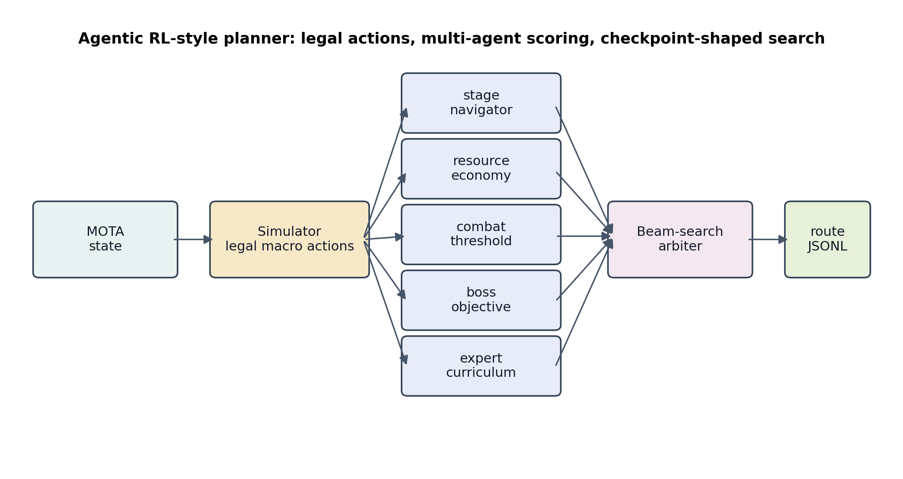
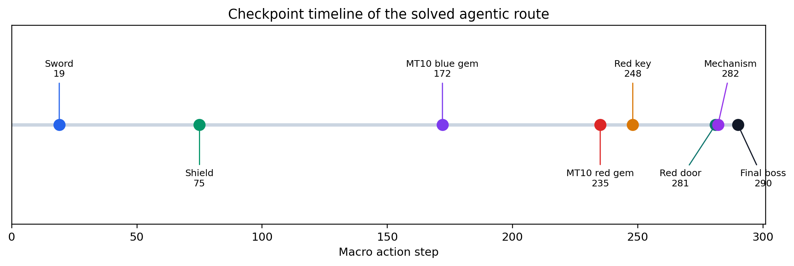
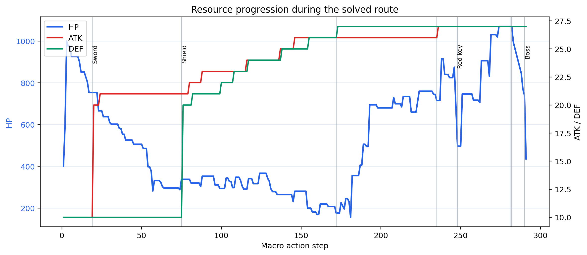
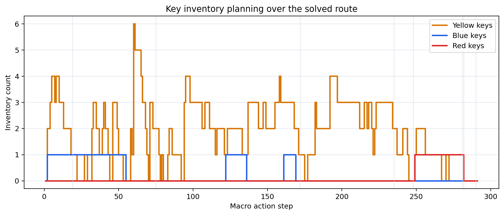
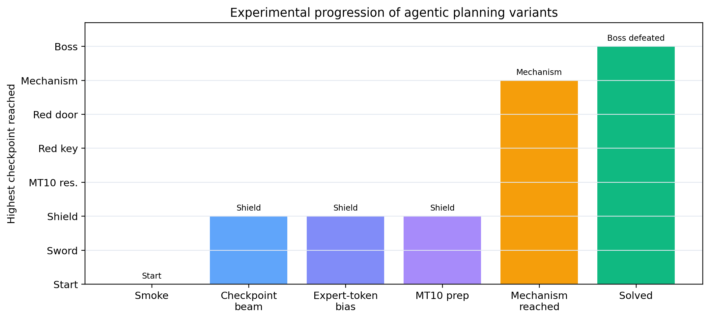

# Agentic MOTA Figure Index

Generated by:

```powershell
conda run -n dl python tools\generate_agentic_report_figures.py
```

All figures are saved in both PNG and SVG formats under:

```text
report/figures/
```

## Recommended For Main Report

### 1. System Architecture

Use this figure near the method description.



Suggested caption:

> Agentic RL-style planning framework. The simulator generates legal macro actions, multiple specialized agents score the candidates, and a beam-search arbiter selects the next action to produce a replayable route.

Files:

- `report/figures/agentic_architecture.png`
- `report/figures/agentic_architecture.svg`

### 2. Checkpoint Timeline

Use this figure near the result section.



Suggested caption:

> Key checkpoints reached by the solved route. The agent first obtains the sword and shield, then collects floor-10 resources, obtains the red key, opens the red door, triggers the mechanism, and defeats the final boss.

Files:

- `report/figures/checkpoint_timeline.png`
- `report/figures/checkpoint_timeline.svg`

### 3. Resource Progression

Use this figure to show route quality and long-horizon resource planning.



Suggested caption:

> HP, attack, and defense progression over the solved 291-step macro-action route. Vertical markers denote important checkpoints such as sword, shield, red key, and final boss.

Files:

- `report/figures/resource_progression.png`
- `report/figures/resource_progression.svg`

## Good Optional Figures

### 4. Key Inventory

Use this figure if the report discusses resource economy.



Suggested caption:

> Yellow, blue, and red key inventory over the solved route. The plot highlights the importance of preserving and spending keys at the correct stages.

Files:

- `report/figures/key_inventory.png`
- `report/figures/key_inventory.svg`

### 5. Experimental Progression

Use this figure if the report includes an experiment-process paragraph.



Suggested caption:

> Progression of agentic planning variants. Earlier variants reach partial checkpoints, while the final expert-curriculum agentic planner reaches the final boss checkpoint.

Files:

- `report/figures/experiment_progression.png`
- `report/figures/experiment_progression.svg`

## Suggested Placement

For a short merged report section, use:

1. `agentic_architecture`
2. `checkpoint_timeline`
3. `resource_progression`

For a longer report section, additionally use:

4. `key_inventory`
5. `experiment_progression`

If page space is limited, put `key_inventory` and `experiment_progression` in the appendix.

